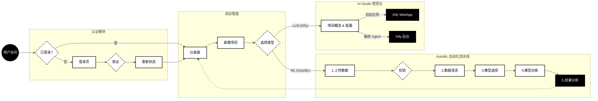

# AiLM - AI Lifecycle Management Platform (Wireframe Edition)

**AiLM** 是一个基于 React 的企业级 AI 全生命周期管理平台原型（Wireframe）。该项目展示了如何管理机器学习（AutoML）任务与大语言模型（LLM）智能体项目的核心业务流程。

整体设计采用高对比度的**线框风格 (Wireframe Style)**，强调功能布局与业务逻辑。

## ✨ 核心功能

### 1. 仪表盘 (Dashboard)
- **项目管理**：统一管理 ML 和 LLM 两类项目。
- **状态追踪**：实时查看项目状态（草稿、训练中、已部署、运行中）。
- **快捷操作**：支持项目搜索、筛选及删除。

### 2. AutoML 自动化建模流水线
针对结构化数据（表格）的端到端建模流程：
- **数据上传**：支持 CSV/Excel 文件上传与预览。
- **数据清洗**：自动检测缺失值、重复项并执行清洗。
- **模型选择**：支持 XGBoost, LightGBM, Random Forest 等多种算法选择。
- **训练监控**：模拟实时训练进度日志。
- **结果评估**：
  - **多维可视化**：预测拟合曲线（Composed Chart）、特征重要性排序（Bar Chart）、模型能力雷达图（Radar Chart）。
  - **详细报告**：生成包含 MSE/RMSE/MAE 指标及残差分析的专业评估报告模态框。

### 3. AI Studio (LLM 管控台)
针对 Dify 等 LLM 应用的集成管理：
- **项目概览**：展示应用描述、模型参数配置 (Temperature, Top P 等)。
- **知识库管理**：查看关联的 RAG 知识库状态及分段详情。
- **集成接口**：提供 WebApp 跳转链接及 API 调用凭证查看。

## 🛠 技术栈

- **Frontend Framework**: React 19 (Vite)
- **Language**: TypeScript
- **Styling**: Tailwind CSS (Custom Wireframe Theme)
- **Routing**: React Router DOM v7
- **Visualization**: Recharts (Composed Chart, Radar Chart, Bar Chart)
- **Icons**: Lucide React

## 📊 业务流程图



## 🚀 快速开始

1. **安装依赖**
   ```bash
   npm install
   ```

2. **启动开发服务器**
   ```bash
   npm run dev
   ```

3. **构建生产版本**
   ```bash
   npm run build
   ```

## 📂 项目结构

```
/
├── components/       # 公共组件 (Layout 等)
├── context/          # 全局状态管理 (User, Projects)
├── pages/
│   ├── Login.tsx     # 登录页
│   ├── Dashboard.tsx # 项目列表
│   ├── NewProject.tsx# 新建向导
│   ├── AutoML.tsx    # 核心 ML 流水线逻辑
│   └── AIStudio.tsx  # LLM 项目详情页
├── services/         # API 服务 (模拟)
├── types.ts          # TypeScript 类型定义
└── App.tsx           # 路由配置
```